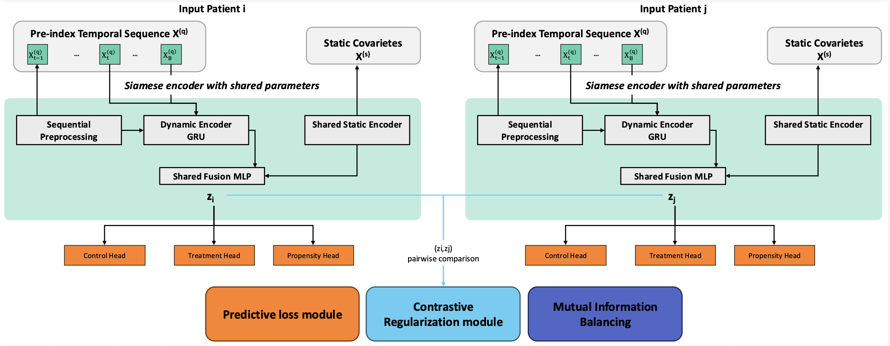

# CHRONOS

**Causal-Temporal Representation Learning for Comorbidity Progression Risk in Longitudinal Primary-Care Data**



## Overview

CHRONOS is a research framework for estimating and analysing directed comorbidity progression risks from longitudinal primary-care data.

The framework is designed to move beyond raw temporal co-occurrence between diseases. Instead, each candidate disease pair is formulated as an edge-specific observational causal question, where an index disease is treated as the exposure and a subsequent disease is treated as the outcome observed during a follow-up window.

In this repository, each directed disease pair is represented as:

```text
Disease A -> Disease B
```

where `Disease A` is the exposure or index condition, and `Disease B` is the outcome condition observed after the index time.

CHRONOS combines:

- edge-level target trial emulation;
- longitudinal patient-history modelling;
- causal adjustment for exposure assignment;
- neural representation learning;
- effect-guided Siamese contrastive regularization;
- mutual-information-based balancing;
- cross-fitted doubly robust estimation;
- edge-level aggregation for comorbidity progression network discovery.

## Repository Scope

This repository contains the code and supplementary resources used to support the CHRONOS framework.

The codebase can be used to:

1. construct edge-specific target-trial cohorts from longitudinal records;
2. train CHRONOS on disease-progression tasks;
3. estimate edge-level causal progression effects;
4. run ablation studies;
5. compare CHRONOS with simpler causal and predictive baselines;
6. perform Cox-style baseline analyses;
7. aggregate disease-pair results into summary tables;
8. inspect supplementary figures, result files, and synthetic example data.

The repository is intended to support methodological transparency, code-level reproducibility, and reuse of the CHRONOS pipeline on compatible governed healthcare datasets.

## Method Summary

CHRONOS follows a multi-stage pipeline.

### 1. Edge-specific target trial emulation

For each candidate directed disease pair `A -> B`, CHRONOS constructs an emulated target-trial cohort.

The cohort construction step defines:

- exposed patients, who experience disease category `A`;
- control patients, who have not experienced disease category `A` at the corresponding index time;
- a baseline window used to construct pre-exposure covariates;
- washout periods to reduce temporal leakage and reverse-causality artifacts;
- a follow-up window used to observe disease category `B`.

This design turns each disease pair into a specific progression-risk question rather than a simple co-occurrence count.

### 2. Temporal representation learning

Patient histories are encoded as longitudinal clinical sequences. CHRONOS combines temporal information and baseline covariates into a shared latent representation.

The learned representation is used to estimate:

- the potential outcome under control;
- the potential outcome under exposure;
- the propensity of receiving the exposure.

### 3. Effect-guided Siamese contrastive learning

CHRONOS includes an effect-guided Siamese contrastive regularization component.

Patients with similar estimated treatment effects are encouraged to have nearby latent representations, while patients with dissimilar estimated treatment effects are encouraged to be separated in the latent space.

This component is intended to organize the representation space according to progression-risk similarity, rather than only according to predictive similarity or disease-history similarity.

### 4. Mutual-information-based balancing

CHRONOS optionally uses a mutual-information neural estimator to reduce residual dependence between exposure assignment and the learned representation.

This component acts as a balancing regularizer and is intended to improve treated-control comparability in the learned latent space.

### 5. Cross-fitted doubly robust estimation

After representation learning, CHRONOS estimates edge-level causal effects using cross-fitted nuisance models and doubly robust estimation.

The final output is an edge-level result table containing estimated effects, uncertainty estimates, diagnostic quantities, and multiple-testing correction values where applicable.

## Repository Structure

```text
CHRONOS/
│
├── src/
│   ├── chronos/
│   │   ├── dataset.py              # Target-trial dataset construction
│   │   ├── model.py                # CHRONOS model and neural components
│   │   ├── train.py                # Training and edge-level estimation
│   │   └── run_all_trials.py       # Utilities for running multiple disease-pair trials
│   │
│   ├── experiment_suite.py         # Ablation and sensitivity experiment runner
│   ├── baseline_compare.py         # Baseline comparison script
│   ├── cox_baseline.py             # Cox-style baseline analysis
│   └── run_all_cox.py              # Batch execution for Cox-style baselines
│
├── chronos_example_data/           # Synthetic toy data for input-format illustration
├── ablation/                       # Supplementary ablation outputs
├── baseline_compare/               # Supplementary baseline-comparison outputs
├── fig/                            # Architecture diagram and additional figures
├── MASTER_COX_DX_DX.csv            # Aggregated Cox-style edge-level results
├── LICENSE
└── README.md
```

## Data Availability

The real-world data used in the CHRONOS study are **not publicly available**.

The study relies on sensitive longitudinal primary-care records subject to privacy, governance, and ethical restrictions. Therefore, raw patient-level data cannot be shared, redistributed, or released through this repository.

This includes:

- raw patient tables;
- processed patient-level datasets;
- intermediate files derived from the original data;
- any file that could expose sensitive clinical information.

For this reason, the repository provides the codebase, analysis workflow, synthetic example data, supplementary outputs, and result files, but not the original real-world patient dataset.

## Synthetic Example Data

The folder `chronos_example_data/` contains synthetic files created only to illustrate the expected input structure of the CHRONOS pipeline.

These files:

- do **not** contain real patient data;
- do **not** correspond to the original study cohort;
- are provided only as toy examples for documentation and usability;
- should not be used to reproduce the numerical results reported in the real-world study.

Field names may reflect the structure expected by the pipeline, but all records in this folder are artificial.

## Installation

Clone the repository:

```bash
git clone https://github.com/FLaTNNBio/CHRONOS.git
cd CHRONOS
```

Create a Python virtual environment:

```bash
python -m venv .venv
source .venv/bin/activate
```

On Windows:

```bash
python -m venv .venv
.venv\Scripts\activate
```

Install the required Python packages:

```bash
pip install numpy pandas scikit-learn torch
```

If a `requirements.txt` file is added to the repository, the environment can instead be installed with:

```bash
pip install -r requirements.txt
```

## Running CHRONOS on a Single Disease Edge

The main training script is:

```text
src/chronos/train.py
```

A typical edge-specific run has the following structure:

```bash
python src/chronos/train.py \
  --data <path/to/input_data.csv> \
  --treatment_codes ENDO \
  --outcome_codes DIGE \
  --out_path results/chronos_full__ENDO__DIGE.csv \
  --epochs 10 \
  --n_folds 5 \
  --batch_size 1024 \
  --latent_dim 64 \
  --baseline_window 180 \
  --followup_window 365 \
  --washout_treatment 180 \
  --outcome_washout 30 \
  --buffer_days 14 \
  --control_ratio 3 \
  --alpha 0.5 \
  --beta 0.1 \
  --gamma 0.01 \
  --use_mine \
  --weighted_sampling \
  --add_qvalues
```

In this example, CHRONOS estimates the directed progression effect:

```text
ENDO -> DIGE
```

that is, the estimated contribution of an endocrine/metabolic disease category to the subsequent risk of a digestive disease category within the specified follow-up window.

## Running the Experiment Suite

The repository includes an experiment runner for ablation and sensitivity analyses:

```text
src/experiment_suite.py
```

A compact run can be launched as:

```bash
python src/experiment_suite.py \
  --data <path/to/input_data.csv> \
  --out_dir results_experiments \
  --mode quick \
  --epochs 10
```

The available modes are:

```text
quick   Run a compact set of representative disease-pair edges.
paper   Run the main paper-oriented ablation and sensitivity suite.
full    Run all directed disease-category edges.
custom  Run user-specified edges.
```

Example with custom edges:

```bash
python src/experiment_suite.py \
  --data <path/to/input_data.csv> \
  --out_dir results_custom \
  --mode custom \
  --custom_edges "ENDO->DIGE,MENT->NERV" \
  --epochs 10
```

## Ablation Studies

The `ablation/` folder contains supplementary outputs for different CHRONOS variants.

The main variants are:

| Variant | Description |
|---|---|
| `chronos_full` | Full CHRONOS model with temporal representation learning, effect-guided contrastive regularization, and mutual-information balancing |
| `no_contrastive` | CHRONOS without the effect-guided contrastive objective |
| `no_mi` | CHRONOS without the mutual-information balancing component |
| `pred_only` | Predictive-only neural variant used as an internal baseline |

These ablations are used to assess the contribution of each major methodological component.

## Baseline Comparison

The repository includes a baseline-comparison script:

```text
src/baseline_compare.py
```

The comparison may include methods such as:

- naive risk difference;
- logistic-regression-based estimators;
- inverse-probability-weighted estimators;
- augmented inverse-probability-weighted estimators;
- full CHRONOS;
- predictive-only neural baselines.

Example:

```bash
python src/baseline_compare.py \
  --data <path/to/input_data.csv> \
  --out_dir baseline_compare \
  --mode paper \
  --methods naive_rd,aipw_logistic,chronos_full,pred_only \
  --epochs 10
```

The output files are written to the selected output directory and include edge-level estimates and summary tables.

## Cox-style Baseline Analyses

The repository also includes Cox-style baseline scripts:

```text
src/cox_baseline.py
src/run_all_cox.py
```

These scripts support additional time-to-event baseline analyses and produce aggregated edge-level results such as:

```text
MASTER_COX_DX_DX.csv
```

Example command:

```bash
python src/run_all_cox.py \
  --data <path/to/input_data.csv> \
  --out_dir cox_results
```

## Output Files

CHRONOS produces CSV files containing edge-level causal estimates and diagnostic quantities.

Depending on the script and configuration, output files may include:

- exposure disease category;
- outcome disease category;
- estimated average treatment effect;
- standard error;
- confidence interval;
- p-value;
- q-value or FDR-adjusted significance;
- placebo estimate;
- effective sample size;
- number of treated patients;
- number of control patients;
- propensity-score diagnostics;
- model configuration metadata.

Aggregated files named `MASTER__*.csv` or similarly structured summary files collect results across multiple disease-pair edges.

## Main Hyperparameters

| Argument | Description |
|---|---|
| `--data` | Input CSV file |
| `--treatment_codes` | Exposure disease code or category |
| `--outcome_codes` | Outcome disease code or category |
| `--baseline_window` | Number of days used to construct baseline covariates |
| `--followup_window` | Number of days used to observe the outcome |
| `--washout_treatment` | Washout period for treatment/exposure definition |
| `--outcome_washout` | Washout period for the outcome |
| `--buffer_days` | Temporal buffer between exposure and outcome |
| `--control_ratio` | Ratio of sampled controls per exposed patient |
| `--latent_dim` | Size of the learned latent representation |
| `--alpha` | Weight of the contrastive component |
| `--beta` | Weight of the mutual-information component |
| `--gamma` | Additional balancing or regularization weight |
| `--use_mine` | Enable mutual-information neural estimation |
| `--weighted_sampling` | Enable weighted sampling |
| `--add_qvalues` | Add multiple-testing correction |

## Disease Categories

The framework operates on broad disease categories. The representative category labels used in the experiment scripts include:

```text
INFE, NEOP, ENDO, BLD, MENT, NERV, CIRC, RESP,
DIGE, GEN, SKIN, MUSC, CONG, PERI, INJ, SUPP
```

Each directed pair `A -> B` is interpreted as an edge-specific disease progression question.

## Supplementary Material

This repository includes supplementary material supporting the CHRONOS framework and its experimental evaluation.

The supplementary resources complement the main manuscript by providing additional methodological details, descriptive statistics, complete edge-level results, robustness analyses, ablation studies, baseline comparisons, Cox-style epidemiological analyses, figures, and synthetic example data.

### Supplementary Material Index

The supplementary material is organized into ten sections:

### Supplementary Material Index and Main Findings

The supplementary material is organized as a reader-oriented guide to the additional analyses supporting CHRONOS. Each section reports methodological details, empirical results, robustness diagnostics, or baseline comparisons that help contextualize and interpret the main findings reported in the paper.

| Section | Title                                                 | What it contains                                                                                                                                                                      | Main takeaway                                                                                                                                                                                                                                                                                             |
| ------- | ----------------------------------------------------- | ------------------------------------------------------------------------------------------------------------------------------------------------------------------------------------- | --------------------------------------------------------------------------------------------------------------------------------------------------------------------------------------------------------------------------------------------------------------------------------------------------------- |
| **S1**  | Data Processing and ICD-9 Macro-Category Mapping      | Describes how raw ICD-9-CM diagnosis codes are aggregated into CHRONOS macro-categories.                                                                                              | The aggregation reduces sparsity in the raw diagnosis-code space and makes large-scale edge-level target-trial emulation feasible. However, heterogeneous categories such as `SUPP` should be interpreted with additional caution.                                                                        |
| **S2**  | Cohort Summary and Descriptive Statistics             | Reports cohort-level statistics, including the number of patients, diagnosis events, calendar span, follow-up duration, age, sex distribution, and most represented macro-categories. | The processed cohort is large and longitudinally rich, with 64,828 patients, more than 9 million diagnosis events, and a median follow-up of approximately six years, supporting progression-oriented analyses.                                                                                           |
| **S3**  | Causal Identification Assumptions                     | Formalizes the assumptions required for causal interpretation, including SUTVA, consistency, no interference, ignorability, and positivity.                                           | CHRONOS estimates admit a causal interpretation only under standard observational identification assumptions. Residual confounding may remain because some clinically relevant factors are not directly observed.                                                                                         |
| **S4**  | Complete `D_a -> D_b` Edge Results                    | Provides the full directed disease-pair screening table, including ATE estimates, confidence intervals, placebo diagnostics, sample support, and FDR correction.                      | The full table allows readers to identify directed disease-pair relations with stronger progression-risk signals while jointly inspecting uncertainty, placebo behavior, sample support, and multiple-testing-adjusted significance.                                                                      |
| **S5**  | Additional Robustness Diagnostics                     | Reports overlap, effective sample size, and placebo diagnostics across the tested edges.                                                                                              | Edges with better overlap, larger effective sample size, and smaller placebo effects are more stable and more interpretable. Conversely, edges with large placebo activity should be treated cautiously even when statistically significant.                                                              |
| **S6**  | Implementation and Hyperparameter Configuration       | Summarizes the model architecture, optimization settings, loss weights, contrastive parameters, and target-trial design choices.                                                      | The implemented CHRONOS configuration uses a compact latent representation, cross-fitting, propensity clipping, contrastive regularization, mutual-information balancing, and fixed trial-design windows to support stable edge-level estimation.                                                         |
| **S7**  | Sensitivity Analysis of Trial-Design Choices          | Tests alternative buffer periods, follow-up horizons, and treated-to-control sampling ratios.                                                                                         | The results are relatively stable under moderate changes to buffer and follow-up windows. The control-sampling ratio has a stronger impact: moving from 1:3 to 1:1 reduces ESS and removes FDR-significant findings in the representative subset.                                                         |
| **S8**  | Epidemiological Baseline via Edge-Specific Cox Models | Provides a complementary Cox proportional hazards analysis and compares Cox hazard ratios with CHRONOS ATE estimates.                                                                 | Cox models provide an interpretable survival-analysis reference but are more fragile at scale. Out of 225 directed trajectories, 168 produced valid Cox fits, 10 were FDR-significant, and only 4 remained both stable and FDR-significant after support filtering.                                       |


Together, these sections document the preprocessing pipeline, causal assumptions, complete result tables, robustness checks, implementation choices, and comparative analyses used to support the main findings of the CHRONOS study.

### Supplementary Resources

The supplementary resources distributed with this repository include:

* ablation outputs in `ablation/`;
* baseline-comparison outputs in `baseline_compare/`;
* Cox-style edge-level results such as `MASTER_COX_DX_DX.csv`;
* architecture diagrams and additional figures in `fig/`;
* synthetic example data in `chronos_example_data/`.

The supplementary material does **not** include the original real-world patient-level dataset. The released resources support code inspection, workflow reproduction on synthetic data, and reuse on compatible governed datasets, but they do not enable full numerical reproduction of the real-world results without authorized access to the original dataset.

## Reproducibility Notes

Because the original patient-level data cannot be released, full numerical reproduction of the real-world study requires access to the governed primary-care dataset.

However, this repository supports reproducibility at the following levels:

- inspection of the modelling and estimation code;
- execution of the pipeline on synthetic example data;
- reproduction of the analysis workflow structure;
- verification of ablation and baseline-comparison scripts;
- reuse of the framework on compatible longitudinal clinical datasets.

When applying CHRONOS to a new dataset, users should verify that the data support the assumptions required for the target-trial design, including appropriate temporal ordering, sufficient follow-up, meaningful exposure definition, and availability of relevant baseline covariates.

## Ethical and Privacy Statement

CHRONOS is designed for research on longitudinal healthcare data.

The framework should be used only with properly governed datasets and under appropriate ethical, institutional, and legal approvals.

No real patient-level data are distributed with this repository.

## License

This project is released under the MIT License. See the `LICENSE` file for details.
